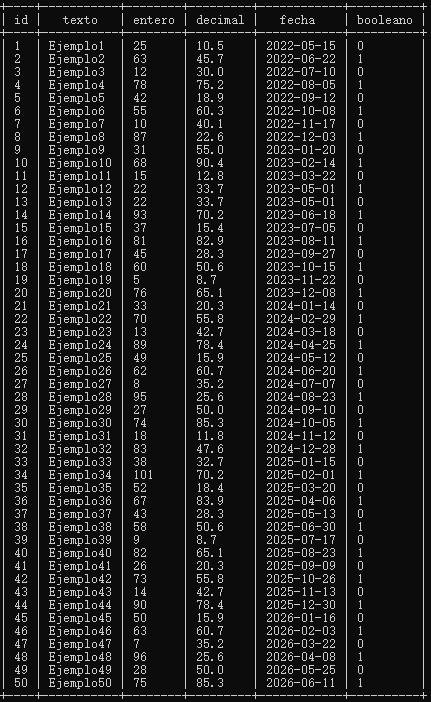
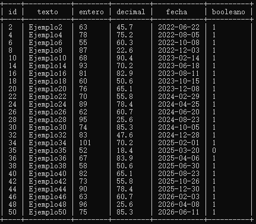
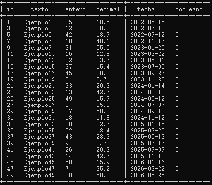
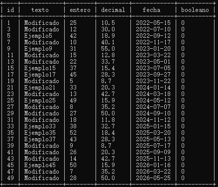
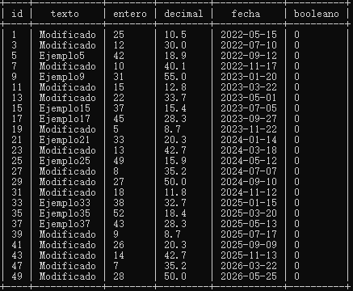
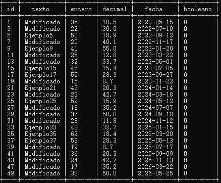
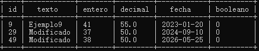
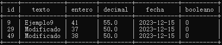

<h1 align="center"> TAREA 1 SQLITE3 </h1>

Para empezar tenemos que crear la tarea en la cuál podremos hacer la práctica:

```sql
sqlite3 tarea1.db
````

Asimismo, crearemos la tabla que la llamaremos Ejemplo, en ella deberemos de crear una serie de columnas y cada una de ellas tendrá que ser de un tipo. Por tanto crearemos una columna para el "id", donde este será INTEGER y además será la PRIMARY KEY de la tabla, seguidamente crearemos la columna "texto" siento esta de tipo TEXT, la columna "entero" de tipo INTEGER, la columna decimal de tipo REAL, la columna "fecha" de tipo DATE y por último la llamada "booleano" de tipo BOOLEAN.

``` sql 
CREATE TABLE Ejemplo (
  id INTEGER PRIMARY KEY,
  texto TEXT,
  entero INTEGER,
  decimal REAL,
  fecha DATE,
  booleano BOOLEAN );
````

Con las columnas creadas lo que nos tocará será meter los datos que introduciremos a la tabla.

```sql
INSERT INTO Ejemplo ( id, texto, entero, decimal, fecha, booleano)
  VALUES ('1', 'Ejemplo1', '25', '10.5', '2022-05-15', '0' );
```
```sql
INSERT INTO Ejemplo ( id, texto, entero, decimal, fecha, booleano)
  VALUES ('2', 'Ejemplo2', '63', '45.7', '2022-06-22', '1' );
```
```sql
INSERT INTO Ejemplo ( id, texto, entero, decimal, fecha, booleano)
  VALUES ( '49', 'Ejemplo49', '28', '50.0', '2026-05-25', '0' );
```
```sql
INSERT INTO Ejemplo ( id, texto, entero, decimal, fecha, booleano)
  VALUES ( '50', 'Ejemplo50', '75', '85.3', '2026-06-11', '1' );
```

<h3> CONSULTA DE DATOS: </h4>

- **Obtén todas las entradas de la tabla Ejemplo.**
  
```sql
SELECT * FROM Ejemplo
```


- **Obtén las entradas con el campo entero mayor a 50.**
  
```sql
SELECT entero FROM Ejemplo WHERE entero > 50
```


<h3>ELIMINAR:</h3>

- **Elimina las entradas donde el campo booleano es igual a True.**

```sql
DELETE FROM Ejemplo WHERE booleano = 1;
```


- **Modifica el campo texto de las entradas donde el campo entero es menor a 30 y establece el texto como "Modificado".**

```sql
UPDATE Ejemplo SET texto = 'Modificado' WHERE entero < 30;
```


- **Elimina las entradas donde el campo entero es igual a 50.**

```sql
DELETE FROM Ejemplo WHERE entero = 50;
```


- **Incrementa en 10 el valor del campo entero para las entradas donde el campo booleano es igual a False.**
```sql
- UPDATE Ejemplo SET entero = entero + 10 WHERE booleano = 0
```


- **Elimina las entradas donde el campo decimal es menor a 50.**
```sql
DELETE FROM Ejemplo WHERE decimal < 50;
```


- **Actualiza el campo fecha de todas las entradas a la fecha actual.**
```sql
UPDATE Ejemplo SET fecha = '2023-12-15';

```

