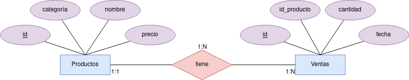
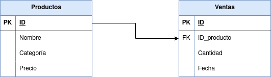

<h1 align="center"> TAREA 4 SQLITE3 </h1>

<div align="center">

</div>

## Paso 1:

Se lealiza un nano para meter los comandos para la creación e inserción de datos en la tabla.

```sql
nano supermercado-dump.sql.
```

Se insertan los siguientes datos:
```sql
CREATE TABLE productos (
    id INTEGER PRIMARY KEY,
    nombre TEXT,
    categoria TEXT,
    precio REAL
);

CREATE TABLE ventas (
    id INTEGER PRIMARY KEY,
    id_producto INTEGER,
    cantidad INTEGER,
    fecha DATE,
    FOREIGN KEY (id_producto) REFERENCES productos(id)
);

INSERT INTO productos (id, nombre, categoria, precio) VALUES 
    (1, 'Arroz', 'Alimentos', 2.5),
    (2, 'Leche', 'Lácteos', 1.8),
    (3, 'Pan', 'Panadería', 1.2),
    (4, 'Manzanas', 'Frutas', 3.0),
    (5, 'Pollo', 'Carnes', 5.5),
    (6, 'Huevos', 'Lácteos', 1.0),
    (7, 'Yogurt', 'Lácteos', 2.0),
    (8, 'Tomates', 'Verduras', 2.2),
    (9, 'Queso', 'Lácteos', 4.0),
    (10, 'Cereal', 'Desayuno', 3.5),
    (11, 'Papel Higiénico', 'Hogar', 1.5),
    (12, 'Cepillo de Dientes', 'Higiene', 2.0),
    (13, 'Detergente', 'Limpieza', 2.8),
    (14, 'Galletas', 'Snacks', 1.7),
    (15, 'Aceite de Oliva', 'Cocina', 4.5),
    (16, 'Café', 'Bebidas', 5.0),
    (17, 'Sopa enlatada', 'Conservas', 2.3),
    (18, 'Jabón de Baño', 'Higiene', 1.2),
    (19, 'Botellas de Agua', 'Bebidas', 1.0),
    (20, 'Cerveza', 'Bebidas', 3.8);

INSERT INTO ventas (id_producto, cantidad, fecha) VALUES 
    (1, 5, '2024-01-17'),
    (2, 3, '2024-01-17'),
    (4, 2, '2024-01-17'),
    (5, 1, '2024-01-17'),
    (6, 10, '2024-01-18'),
    (8, 4, '2024-01-18'),
    (10, 2, '2024-01-18'),
    (14, 7, '2024-01-19'),
    (16, 3, '2024-01-19'),
    (18, 6, '2024-01-20');
```

## Paso 2:

Entramos al sql a través del siguiente comando:

```sql
sqlite3 tarea4.db 
```

Asimismo, para leer el fichero supermercado-dump.sql deberemos de ejecutar el siguiente comando:

```sql
.read supermercado-dump.sql
```
Se nos crearan las siguientes tablas:

#### Productos
```sql
┌────┬────────────────────┬───────────┬────────┐
│ id │       nombre       │ categoria │ precio │
├────┼────────────────────┼───────────┼────────┤
│ 1  │ Arroz              │ Alimentos │ 2.5    │
│ 2  │ Leche              │ Lácteos   │ 1.8    │
│ 3  │ Pan                │ Panadería │ 1.2    │
│ 4  │ Manzanas           │ Frutas    │ 3.0    │
│ 5  │ Pollo              │ Carnes    │ 5.5    │
│ 6  │ Huevos             │ Lácteos   │ 1.0    │
│ 7  │ Yogurt             │ Lácteos   │ 2.0    │
│ 8  │ Tomates            │ Verduras  │ 2.2    │
│ 9  │ Queso              │ Lácteos   │ 4.0    │
│ 10 │ Cereal             │ Desayuno  │ 3.5    │
│ 11 │ Papel Higiénico    │ Hogar     │ 1.5    │
│ 12 │ Cepillo de Dientes │ Higiene   │ 2.0    │
│ 13 │ Detergente         │ Limpieza  │ 2.8    │
│ 14 │ Galletas           │ Snacks    │ 1.7    │
│ 15 │ Aceite de Oliva    │ Cocina    │ 4.5    │
│ 16 │ Café               │ Bebidas   │ 5.0    │
│ 17 │ Sopa enlatada      │ Conservas │ 2.3    │
│ 18 │ Jabón de Baño      │ Higiene   │ 1.2    │
│ 19 │ Botellas de Agua   │ Bebidas   │ 1.0    │
│ 20 │ Cerveza            │ Bebidas   │ 3.8    │
└────┴────────────────────┴───────────┴────────┘
```

#### Ventas
```sql
┌────┬─────────────┬──────────┬────────────┐
│ id │ id_producto │ cantidad │   fecha    │
├────┼─────────────┼──────────┼────────────┤
│ 1  │ 1           │ 5        │ 2024-01-17 │
│ 2  │ 2           │ 3        │ 2024-01-17 │
│ 3  │ 4           │ 2        │ 2024-01-17 │
│ 4  │ 5           │ 1        │ 2024-01-17 │
│ 5  │ 6           │ 10       │ 2024-01-18 │
│ 6  │ 8           │ 4        │ 2024-01-18 │
│ 7  │ 10          │ 2        │ 2024-01-18 │
│ 8  │ 14          │ 7        │ 2024-01-19 │
│ 9  │ 16          │ 3        │ 2024-01-19 │
│ 10 │ 18          │ 6        │ 2024-01-20 │
└────┴─────────────┴──────────┴────────────┘
```

## Paso 3:

- Realiza el diagrama ER de la BBDD supermercado.



- Realiza el diagrama MR de la BBDD supermercado.

- Indica si la BBDD esta normalizada hasta la 3ª forma normal, justificando la respuesta.



Esta base de datos cumple la 3FNº porque cumple con las siguientes reglas:

 - Una Relación está en 1FN si y sólo si cada atributo es atómico.
 - Una Relación esta en 2FN si y sólo si está en 1FN y todos los atributos que NO forman parte de la Clave Principal tienen dependencia funcional completa de ella. En este caso la PK de la tabla de **productos** la hereda la tabla **ventas** para convertirse en la FK.
 - Una Relación esta en 3FN si y sólo si está en 2FN y no existen dependencias transitivas. Todas las dependencias funcionales deben ser respecto a la clave principal.

## Paso 4:

Realiza las siguientes consultas, y muestra el resultado obtenido:

- Mostrar todos los productos de la categoría "Bebidas".

```sql
SELECT id, nombre, precio FROM productos WHERE categoria = 'Bebidas';
```

```sql
┌────┬──────────────────┬────────┐
│ id │      nombre      │ precio │
├────┼──────────────────┼────────┤
│ 16 │ Café             │ 5.0    │
│ 19 │ Botellas de Agua │ 1.0    │
│ 20 │ Cerveza          │ 3.8    │
└────┴──────────────────┴────────┘
```

- Listar los productos ordenados por precio de forma descendente.

```sql
SELECT nombre, precio
FROM productos
ORDER BY precio DESC;
```

```sql
┌────────────────────┬────────┐
│       nombre       │ precio │
├────────────────────┼────────┤
│ Pollo              │ 5.5    │
│ Café               │ 5.0    │
│ Aceite de Oliva    │ 4.5    │
│ Queso              │ 4.0    │
│ Cerveza            │ 3.8    │
│ Cereal             │ 3.5    │
│ Manzanas           │ 3.0    │
│ Detergente         │ 2.8    │
│ Arroz              │ 2.5    │
│ Sopa enlatada      │ 2.3    │
│ Tomates            │ 2.2    │
│ Yogurt             │ 2.0    │
│ Cepillo de Dientes │ 2.0    │
│ Leche              │ 1.8    │
│ Galletas           │ 1.7    │
│ Papel Higiénico    │ 1.5    │
│ Pan                │ 1.2    │
│ Jabón de Baño      │ 1.2    │
│ Huevos             │ 1.0    │
│ Botellas de Agua   │ 1.0    │
└────────────────────┴────────┘
```

- Calcular el precio total de todos los productos en la tabla "productos".

```sql
SELECT SUM(precio) AS precio_total FROM productos; 
```

```sql
┌──────────────┐
│ precio_total │
├──────────────┤
│ 52.5         │
└──────────────┘
```

- Encontrar los productos con un nombre que contenga la letra 'a'.

```sql
SELECT nombre FROM productos WHERE nombre LIKE '%a%';
```

```sql
┌──────────────────┐
│      nombre      │
├──────────────────┤
│ Arroz            │
│ Pan              │
│ Manzanas         │
│ Tomates          │
│ Cereal           │
│ Papel Higiénico  │
│ Galletas         │
│ Aceite de Oliva  │
│ Café             │
│ Sopa enlatada    │
│ Jabón de Baño    │
│ Botellas de Agua │
│ Cerveza          │
└──────────────────┘
```

- Obtener la cantidad total de productos vendidos en todas las fechas.

```sql
SELECT SUM(cantidad) AS cantidad_total_vendida
FROM ventas;
```

```sql
┌────────────────────────┐
│ cantidad_total_vendida │
├────────────────────────┤
│ 43                     │
└────────────────────────┘
```

- Encontrar el producto más caro en cada categoría.

```sql
SELECT nombre, categoria, MAX(precio)
AS producto_mas_caro
FROM productos
GROUP BY categoria;
```

```sql
┌────────────────────┬───────────┬───────────────────┐
│       nombre       │ categoria │ producto_mas_caro │
├────────────────────┼───────────┼───────────────────┤
│ Arroz              │ Alimentos │ 2.5               │
│ Café               │ Bebidas   │ 5.0               │
│ Pollo              │ Carnes    │ 5.5               │
│ Aceite de Oliva    │ Cocina    │ 4.5               │
│ Sopa enlatada      │ Conservas │ 2.3               │
│ Cereal             │ Desayuno  │ 3.5               │
│ Manzanas           │ Frutas    │ 3.0               │
│ Cepillo de Dientes │ Higiene   │ 2.0               │
│ Papel Higiénico    │ Hogar     │ 1.5               │
│ Detergente         │ Limpieza  │ 2.8               │
│ Queso              │ Lácteos   │ 4.0               │
│ Pan                │ Panadería │ 1.2               │
│ Galletas           │ Snacks    │ 1.7               │
│ Tomates            │ Verduras  │ 2.2               │
└────────────────────┴───────────┴───────────────────┘
```

- Listar los productos que no han sido vendidos.

```sql
SELECT *
FROM productos
WHERE id NOT IN (SELECT p.id FROM productos AS p, ventas AS v WHERE p.id=v.id_producto);
```

```sql
┌────┬────────────────────┬───────────┬────────┐
│ id │       nombre       │ categoria │ precio │
├────┼────────────────────┼───────────┼────────┤
│ 3  │ Pan                │ Panadería │ 1.2    │
│ 7  │ Yogurt             │ Lácteos   │ 2.0    │
│ 9  │ Queso              │ Lácteos   │ 4.0    │
│ 11 │ Papel Higiénico    │ Hogar     │ 1.5    │
│ 12 │ Cepillo de Dientes │ Higiene   │ 2.0    │
│ 13 │ Detergente         │ Limpieza  │ 2.8    │
│ 15 │ Aceite de Oliva    │ Cocina    │ 4.5    │
│ 17 │ Sopa enlatada      │ Conservas │ 2.3    │
│ 19 │ Botellas de Agua   │ Bebidas   │ 1.0    │
│ 20 │ Cerveza            │ Bebidas   │ 3.8    │
└────┴────────────────────┴───────────┴────────┘
```

- Calcular el precio promedio de los productos en la categoría "Snacks".

```sql
SELECT categoria, AVG(precio) AS precio_promedio 
FROM productos
WHERE categoria LIKE 'Snacks';
```

```sql
┌───────────┬─────────────────┐
│ categoria │ precio_promedio │
├───────────┼─────────────────┤
│ Snacks    │ 1.7             │
└───────────┴─────────────────┘
```

- Encontrar los productos que han sido vendidos más de 5 veces.

```sql
SELECT p.nombre, v.cantidad
FROM productos AS p, ventas AS v
WHERE p.id = v.id_producto and v.cantidad > 5;
```

```sql
┌───────────────┬──────────┐
│    nombre     │ cantidad │
├───────────────┼──────────┤
│ Huevos        │ 10       │
│ Galletas      │ 7        │
│ Jabón de Baño │ 6        │
└───────────────┴──────────┘
```

- Mostrar la fecha y la cantidad de ventas para cada producto.

```sql
SELECT p.nombre, v.cantidad, v.fecha
FROM productos AS p, ventas AS v
WHERE p.id = v.id_producto;
```

```sql
┌───────────────┬──────────┬────────────┐
│    nombre     │ cantidad │   fecha    │
├───────────────┼──────────┼────────────┤
│ Arroz         │ 5        │ 2024-01-17 │
│ Leche         │ 3        │ 2024-01-17 │
│ Manzanas      │ 2        │ 2024-01-17 │
│ Pollo         │ 1        │ 2024-01-17 │
│ Huevos        │ 10       │ 2024-01-18 │
│ Tomates       │ 4        │ 2024-01-18 │
│ Cereal        │ 2        │ 2024-01-18 │
│ Galletas      │ 7        │ 2024-01-19 │
│ Café          │ 3        │ 2024-01-19 │
│ Jabón de Baño │ 6        │ 2024-01-20 │
└───────────────┴──────────┴────────────┘
```

- Encontrar los productos que tienen un precio menor o igual a 2.

```sql
SELECT nombre, precio
FROM productos 
WHERE precio <= 2;
```

```sql
┌────────────────────┬────────┐
│       nombre       │ precio │
├────────────────────┼────────┤
│ Leche              │ 1.8    │
│ Pan                │ 1.2    │
│ Huevos             │ 1.0    │
│ Yogurt             │ 2.0    │
│ Papel Higiénico    │ 1.5    │
│ Cepillo de Dientes │ 2.0    │
│ Galletas           │ 1.7    │
│ Jabón de Baño      │ 1.2    │
│ Botellas de Agua   │ 1.0    │
└────────────────────┴────────┘
```

- Calcular la cantidad total de ventas para cada fecha.

```sql
SELECT fecha, SUM(cantidad) AS cantidad_total_vendida
FROM ventas
GROUP BY fecha;
```

```sql
┌────────────┬────────────────────────┐
│   fecha    │ cantidad_total_vendida │
├────────────┼────────────────────────┤
│ 2024-01-17 │ 11                     │
│ 2024-01-18 │ 16                     │
│ 2024-01-19 │ 10                     │
│ 2024-01-20 │ 6                      │
└────────────┴────────────────────────┘
```

- Listar los productos cuyo nombre comienza con la letra 'P'.

```sql
SELECT nombre 
FROM productos
WHERE nombre LIKE 'P%';
```

```sql
┌─────────────────┐
│     nombre      │
├─────────────────┤
│ Pan             │
│ Pollo           │
│ Papel Higiénico │
└─────────────────┘
```

- Obtener el producto más vendido en términos de cantidad.

```sql
SELECT p.nombre, MAX(cantidad) AS cantidad_máxima
FROM productos AS p, ventas AS v
WHERE p.id=v.id_producto;
```

```sql
┌────────┬─────────────────┐
│ nombre │ cantidad_máxima │
├────────┼─────────────────┤
│ Huevos │ 10              │
└────────┴─────────────────┘
```

- Mostrar los productos que fueron vendidos en la fecha '2024-01-18'.

```sql
SELECT p.nombre, v.fecha
FROM productos AS p, ventas AS v
WHERE p.id=v.id_producto AND fecha='2024-01-18';
```

```sql
┌─────────┬────────────┐
│ nombre  │   fecha    │
├─────────┼────────────┤
│ Huevos  │ 2024-01-18 │
│ Tomates │ 2024-01-18 │
│ Cereal  │ 2024-01-18 │
└─────────┴────────────┘
```

- Calcular el total de ventas para cada producto.

```sql
SELECT p.nombre, v.cantidad
FROM productos AS p, ventas AS v
WHERE p.id=v.id_producto;
```

```sql
┌───────────────┬──────────┐
│    nombre     │ cantidad │
├───────────────┼──────────┤
│ Arroz         │ 5        │
│ Leche         │ 3        │
│ Manzanas      │ 2        │
│ Pollo         │ 1        │
│ Huevos        │ 10       │
│ Tomates       │ 4        │
│ Cereal        │ 2        │
│ Galletas      │ 7        │
│ Café          │ 3        │
│ Jabón de Baño │ 6        │
└───────────────┴──────────┘
```

- Encontrar los productos con un precio entre 3 y 4.

```sql
SELECT nombre, precio
FROM productos
WHERE precio between 3 and 4;
```

```sql
┌──────────┬────────┐
│  nombre  │ precio │
├──────────┼────────┤
│ Manzanas │ 3.0    │
│ Queso    │ 4.0    │
│ Cereal   │ 3.5    │
│ Cerveza  │ 3.8    │
└──────────┴────────┘
```

- Listar los productos y sus categorías ordenados alfabéticamente por categoría.

```sql
SELECT nombre, categoria
FROM productos
ORDER BY categoria ASC;
```

```sql
┌────────────────────┬───────────┐
│       nombre       │ categoria │
├────────────────────┼───────────┤
│ Arroz              │ Alimentos │
│ Café               │ Bebidas   │
│ Botellas de Agua   │ Bebidas   │
│ Cerveza            │ Bebidas   │
│ Pollo              │ Carnes    │
│ Aceite de Oliva    │ Cocina    │
│ Sopa enlatada      │ Conservas │
│ Cereal             │ Desayuno  │
│ Manzanas           │ Frutas    │
│ Cepillo de Dientes │ Higiene   │
│ Jabón de Baño      │ Higiene   │
│ Papel Higiénico    │ Hogar     │
│ Detergente         │ Limpieza  │
│ Leche              │ Lácteos   │
│ Huevos             │ Lácteos   │
│ Yogurt             │ Lácteos   │
│ Queso              │ Lácteos   │
│ Pan                │ Panadería │
│ Galletas           │ Snacks    │
│ Tomates            │ Verduras  │
└────────────────────┴───────────┘
```

- Calcular el precio total de los productos vendidos en la fecha '2024-01-19'.

```sql
SELECT SUM(p.precio * v.cantidad) AS precio_total
FROM productos AS p, ventas AS v
WHERE v.fecha = '2024-01-19' and p.id=v.id_producto;
```

```sql
┌──────────────┐
│ precio_total │
├──────────────┤
│ 26.9         │
└──────────────┘
```

- Mostrar los productos que no pertenecen a la categoría "Higiene".

```sql
SELECT * 
FROM productos
WHERE NOT categoria='Higiene';
```

```sql
┌────┬──────────────────┬───────────┬────────┐
│ id │      nombre      │ categoria │ precio │
├────┼──────────────────┼───────────┼────────┤
│ 1  │ Arroz            │ Alimentos │ 2.5    │
│ 2  │ Leche            │ Lácteos   │ 1.8    │
│ 3  │ Pan              │ Panadería │ 1.2    │
│ 4  │ Manzanas         │ Frutas    │ 3.0    │
│ 5  │ Pollo            │ Carnes    │ 5.5    │
│ 6  │ Huevos           │ Lácteos   │ 1.0    │
│ 7  │ Yogurt           │ Lácteos   │ 2.0    │
│ 8  │ Tomates          │ Verduras  │ 2.2    │
│ 9  │ Queso            │ Lácteos   │ 4.0    │
│ 10 │ Cereal           │ Desayuno  │ 3.5    │
│ 11 │ Papel Higiénico  │ Hogar     │ 1.5    │
│ 13 │ Detergente       │ Limpieza  │ 2.8    │
│ 14 │ Galletas         │ Snacks    │ 1.7    │
│ 15 │ Aceite de Oliva  │ Cocina    │ 4.5    │
│ 16 │ Café             │ Bebidas   │ 5.0    │
│ 17 │ Sopa enlatada    │ Conservas │ 2.3    │
│ 19 │ Botellas de Agua │ Bebidas   │ 1.0    │
│ 20 │ Cerveza          │ Bebidas   │ 3.8    │
└────┴──────────────────┴───────────┴────────┘
```

- Encontrar la cantidad total de productos en cada categoría.

```sql
SELECT categoria, COUNT(nombre) AS cantidad_total
FROM productos 
GROUP BY categoria;
```

```sql
┌───────────┬────────────────┐
│ categoria │ cantidad_total │
├───────────┼────────────────┤
│ Alimentos │ 1              │
│ Bebidas   │ 3              │
│ Carnes    │ 1              │
│ Cocina    │ 1              │
│ Conservas │ 1              │
│ Desayuno  │ 1              │
│ Frutas    │ 1              │
│ Higiene   │ 2              │
│ Hogar     │ 1              │
│ Limpieza  │ 1              │
│ Lácteos   │ 4              │
│ Panadería │ 1              │
│ Snacks    │ 1              │
│ Verduras  │ 1              │
└───────────┴────────────────┘
```

- Listar los productos que tienen un precio igual a la media de precios.

```sql
SELECT id, nombre, precio
FROM productos
WHERE precio = (SELECT AVG(precio) FROM productos);
```

En este caso, no sale ninguna tabla ya que no hay ningún producto que tenga el mismo precio a la media de precios. Esta media se calculará de la siguiente forma:

```sql
SELECT AVG(precio) AS precio_medio 
FROM productos;
```

```sql
┌──────────────┐
│ precio_medio │
├──────────────┤
│ 2.625        │
└──────────────┘
```

- Calcular el precio total de los productos vendidos en cada fecha.

```sql 
SELECT SUM(p.precio) AS precio_total, v.fecha
FROM productos AS p, ventas AS v
WHERE p.id=v.id_producto
GROUP BY fecha;
```

```sql
┌──────────────┬────────────┐
│ precio_total │   fecha    │
├──────────────┼────────────┤
│ 12.8         │ 2024-01-17 │
│ 6.7          │ 2024-01-18 │
│ 6.7          │ 2024-01-19 │
│ 1.2          │ 2024-01-20 │
└──────────────┴────────────┘
```

- Mostrar los productos con un nombre que termina con la letra 'o'.

```sql
SELECT nombre 
FROM productos 
WHERE nombre LIKE '%o';
```

```sql
┌─────────────────┐
│     nombre      │
├─────────────────┤
│ Pollo           │
│ Queso           │
│ Papel Higiénico │
│ Jabón de Baño   │
└─────────────────┘
```

- Encontrar los productos que han sido vendidos en más de una fecha.

```sql
SELECT p.id, p.nombre, v.fecha 
FROM productos AS p, ventas AS v 
WHERE p.id = v.id_producto 
GROUP BY p.id 
HAVING COUNT(DISTINCT fecha) > 1;
```

En este caso no se encuentra ningún producto.

- Listar los productos cuya categoría comienza con la letra 'L'.

```sql
SELECT nombre, categoria
FROM productos
WHERE categoria LIKE 'L%';
```

```sql
┌────────────┬───────────┐
│   nombre   │ categoria │
├────────────┼───────────┤
│ Leche      │ Lácteos   │
│ Huevos     │ Lácteos   │
│ Yogurt     │ Lácteos   │
│ Queso      │ Lácteos   │
│ Detergente │ Limpieza  │
└────────────┴───────────┘
```

- Calcular el total de ventas para cada producto en la fecha '2024-01-17'.

```sql
SELECT p.nombre, v.cantidad 
FROM productos AS p, ventas AS v 
WHERE p.id=v.id_producto AND fecha='2024-01-17';
```

```sql
┌──────────┬──────────┐
│  nombre  │ cantidad │
├──────────┼──────────┤
│ Arroz    │ 5        │
│ Leche    │ 3        │
│ Manzanas │ 2        │
│ Pollo    │ 1        │
└──────────┴──────────┘
```

- Mostrar los productos cuyo nombre tiene al menos 5 caracteres.

```sql
SELECT nombre 
FROM productos 
WHERE LENGTH(nombre) >= 5;
```

```sql
┌────────────────────┐
│       nombre       │
├────────────────────┤
│ Arroz              │
│ Leche              │
│ Manzanas           │
│ Pollo              │
│ Huevos             │
│ Yogurt             │
│ Tomates            │
│ Queso              │
│ Cereal             │
│ Papel Higiénico    │
│ Cepillo de Dientes │
│ Detergente         │
│ Galletas           │
│ Aceite de Oliva    │
│ Sopa enlatada      │
│ Jabón de Baño      │
│ Botellas de Agua   │
│ Cerveza            │
└────────────────────┘
```

- Encontrar los productos que tienen un precio superior al precio medio en la tabla "productos".

```sql
SELECT * 
FROM productos 
WHERE precio > (SELECT AVG(precio) FROM productos);
```

```sql
┌────┬─────────────────┬───────────┬────────┐
│ id │     nombre      │ categoria │ precio │
├────┼─────────────────┼───────────┼────────┤
│ 4  │ Manzanas        │ Frutas    │ 3.0    │
│ 5  │ Pollo           │ Carnes    │ 5.5    │
│ 9  │ Queso           │ Lácteos   │ 4.0    │
│ 10 │ Cereal          │ Desayuno  │ 3.5    │
│ 13 │ Detergente      │ Limpieza  │ 2.8    │
│ 15 │ Aceite de Oliva │ Cocina    │ 4.5    │
│ 16 │ Café            │ Bebidas   │ 5.0    │
│ 20 │ Cerveza         │ Bebidas   │ 3.8    │
└────┴─────────────────┴───────────┴────────┘
```